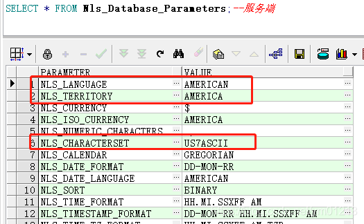

数据库运维


### 四、专项问题

#### 1. 各类数据库密码过期的问题

db2：

​	db2数据库用户就是linux系统的用户，修改系统的用户即更新了数据库的账号密码。


#### 2.Oracle数据初始化新建用户


使用sqlplus / as sysdba 进入终端后

```sql
--创建表空间
create tablespace syjldata
datafile '/u01/app/oracle/oradata/orcl/syjldata.dbf' size 10240M
autoextend on next 10M maxsize unlimited
EXTENT MANAGEMENT local autoallocate
segment space management auto;

--创建用户名
create user syjl_dongnan identified by "friday123"
default tablespace syjldata
temporary tablespace TEMP
profile DEFAULT;

--给新用户赋权限
grant dba to syjl_dongnan ;
grant connect to syjl_dongnan ;
grant resource to syjl_dongnan ;


--先删掉用户与其相关联的表
DROP USER syjlyy_dongnan  CASCADE;

--删除表空间文件。
DROP TABLESPACE syjlyydata INCLUDING CONTENTS AND DATAFILES;


```


### 三. oracle 数据迁移篇


#### 导出用户所有的数据。

```shell
exp  账号/'密码'@127.0.0.1/实例名 file=输出文件的地址.dmp owner=账号 log=日志文件的地址
```

注意：需要注意的是当前的用户有所在表或者所在索引的表空间权限，如果你的用户下面有来自不同表空间的表或索引一定要赋予其读取操作权限。


#### 赋予用户表空间的权限。

```sql
alter user 用户名 quota unlimited on 表空间;
或 alter user 用户名 quota *M on 表空间
```


#### 导出指定的表以及数据

导出时需要添加环境变量用以设置环境变量。

服务端编码

```sql
SELECT * FROM Nls_Database_Parameters;--服务端
```




```shell
export NLS_CHARACTERSET='AMERICAN_AMERICA.US7ASCII';
export NLS_LANG='AMERICAN_AMERICA.US7ASCII'
#1_2.3 格式 见上图
```


```shell
exp  账号/'密码'@127.0.0.1/实例名 file=输出文件的地址.dmp tables="(表名1,表明二)" log=日志文件的地址
```

注意：既然指定了导出的表就不能指定owner字段了


#### 导入用户数据

```shell
imp 账号/'密码'@127.0.0.1/实例名 file=导入文件的地址.dmp fromuser=原用户名 touser=账号 log=日志文件的地址
```


#### 查看表或索引的表空间

查看表的表空间

```sql
select table_name,tablespace_name from all_tables where owner='用户' 
--或 dba_tables
```


查看索引的表空间

```sql
select index_name,index_type,table_owner,table_name,tablespace_name from dba_index where owner='用户' 
```


注意：用户名一定要大写


#### 迁移表或索引或用户到新的表空间

迁移表

```sql
alter table tab_name move tablespace tbs_name;
```

迁移索引

当迁移了表后需要迁移索引或重建索引

重建

```sql
alter index index_name rebuild;
alter index index_name rebuild tablespace tbs_name;
```

设置用户默认表空间

```sql
alter user 用户名 default tablespace 表空间名字 ;
```


### oracle 表空间篇

表空间文件扩容

```sql
alter database datafile '具体表空间文件的路径.dbf'  resize 30480M;
```

注意：最大单个dbf文件为30多g

为表空间增加多个表空间文件

```sql
alter tablespace 表空间名称 add
datafile '具体表空间文件的路径.dbf' size 30480M
autoextend on next 100M maxsize unlimited;
```

 查看表空间以及表空间文件的具体路径

```sql
select  file_name tablespace_name from dba_data_files 
```


### 四、软件篇

#### plsql使用

导出表结构

​	

导出数据


